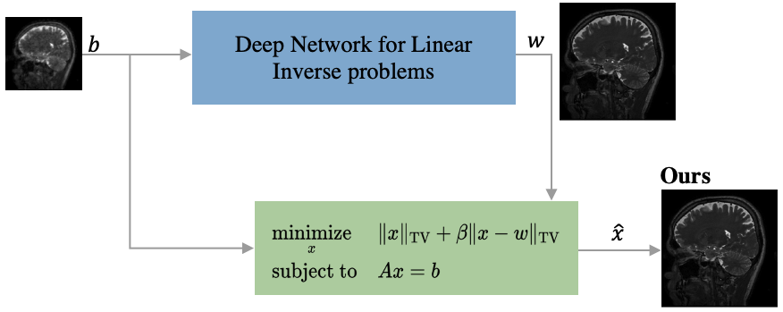
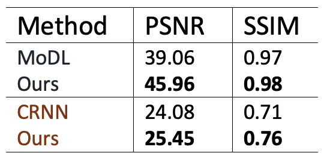
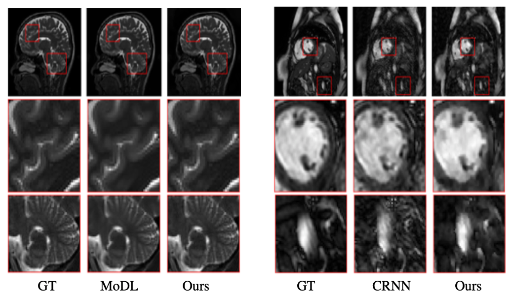

## Overcoming Measurement Inconsistency in Deep Learning for Linear Inverse Problems: Applications in Medical Imaging ##

[](https://app.circleci.com/pipelines/github/marijavella/mri-tvtv)

Python 3.x code to reproduce the experiments in

[Overcoming Measurement Inconsistency in Deep Learning for Linear Inverse Problems: Applications in Medical Imaging](https://arxiv.org/abs/2011.14387)

Marija Vella, João F. C. Mota<br/>
Accepted to ICASSP 2021

### Overview ###

Deep learning (DL) methods are currently the natural choice for solving linear inverse problems. They have been applied to super-resolve and restore images, as well as to reconstruct MR and CT images. DL based methods are able to produce photo-realistic outputs but cannot always guarantee data consistency. Our method enforces this consistency by post-processing the output from a DL based method by solving an optimization problem termed as TV-TV minimization. We higlight the relationship between data consistency and reconstruction quality by running experiments on magnetic resonance images (MRI). 

### Proposed Method ###

Diagram of our method: 

<p align="center"></p>

Given a measurement image and the corresponding reconstructed output w from a MR reconstruction method, the proposed post-processing step guarantees data consistency and improves the quality of w. It achieves that by solving TV-TV minimization:

<p align="center"></p>


## Testing ##

Note that this repo is optimized to give faster execution times rather than better data consistency. The code used in the paper optimizes the consistency resulting in longer running times. The only difference is that the tolerance in the conjugate gradient method is set to 10e-2 in this repo while to obtain the resutlts in the paper, we use 10e-5. This can be easily modified in line 78 in TVTV_Solver.py. 

### Demo ###

Clone this repository and run the demo which takes a sample image from the brain dataset and post processes it with TV-TV minimization

```
git clone https://github.com/marijavella/mri-tvtv
cd mri-tvtv
python demo.py
```

### Testing different networks, datasets and operators ###

We consider two MRI acquisition models: multi-channel (MoDL) and dyanmic MRI (CRNN). The first configuration extracts information from multiple coils while the latter uses a single coil. The measurement matrix A for each is defined as:

#### MoDL ####

To replicate the experiments for MoDL you can use the presaved outputs from MoDL and TV-TV by runing:
```
git clone https://github.com/marijavella/tvtv-mri
python test.py --presaved True
```
To generate the outputs from MoDL and TV-TV by running the whole framework use:
```
git clone https://github.com/marijavella/tvtv-mri
python test.py 
```
Please check test.py for the differet configuartion settings accepted. 

The brain dataset used to test this network can be downloaded from <a href="https://drive.google.com/file/d/1qp-l9kJbRfQU1W5wCjOQZi7I3T6jwA37/view?usp=sharing"> here.</a> Then place this in the ```data``` folder.</p> 

#### CRNN ####

```
git clone https://github.com/marijavella/tvtv-mri
python test.py --network crnn  --beta 0.8 --nsamples 30 --crop False --multi_coil False
```
The sampling mask are randomly generated, to obtain the same results as in the paper, by default the used mask is loaded. If you would like to generate a ranodm mask on every run kindly comment out line 80 in ```uitls/compressed_sensing.py```. 

The provided cardiac dataset can be also downloaded from <a href="https://github.com/js3611/Deep-MRI-Reconstruction/blob/master/data/cardiac.mat"> here.</a></p>


### Results ###

<p align="center"></p>

<p align="center"></p>

### Dependencies ###

To install the required libraries 

```
pip install -r requirements.txt
```

## Contents ##

There are three main folders:

* ```data```: contains the brain and cardiac datasets used for the experiments.

* ```models```: contain the learned parameters for both networks

* ```utils```: contains some functions required to calculate and display results, synthesize measurement images and matrix multiplications for TV-TV.

Other folders:

* ```cascadenet_pytorch```: model of CRNN.

* ```Brain_iter100_10e-5```: saved results from previous runs.

The main scripts are:

* ```demo.py```: script with default settings to run a quick experiment on a single image based on MoDL.

* ```test.py```: testing code that allows different. 

* ```TVTV_Solver.py```:  TV-TV solver code.

## Acknowledgements ##

Our code makes use of the Github repositories of [MoDL](https://github.com/hkaggarwal/modl) and [CRNN](https://github.com/js3611/Deep-MRI-Reconstruction). The latter has been used according to the Apache License, Version 2.0 license. 

## Citation  ##

```
Vella, M. & Mota, J.F.C. Overcoming Measurement Inconsistency in Deep Learning for Linear Inverse Problems: Applications in Medical Imaging. ArXiv 
```

### Contact ###

The code is provided to be able to replicate our research. If you encounter and errors or would like to give any suggestions kindly contact me directly on mv37@hw.ac.uk.


